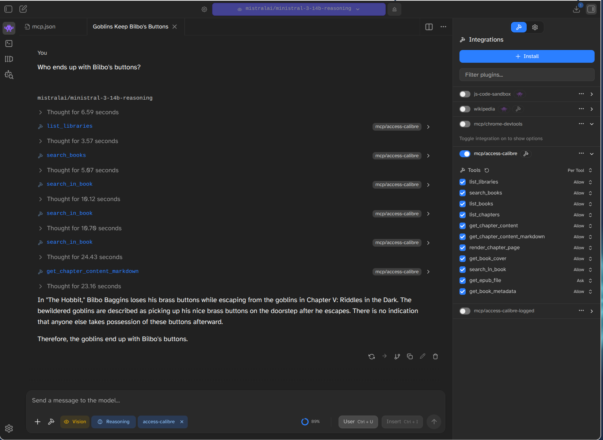
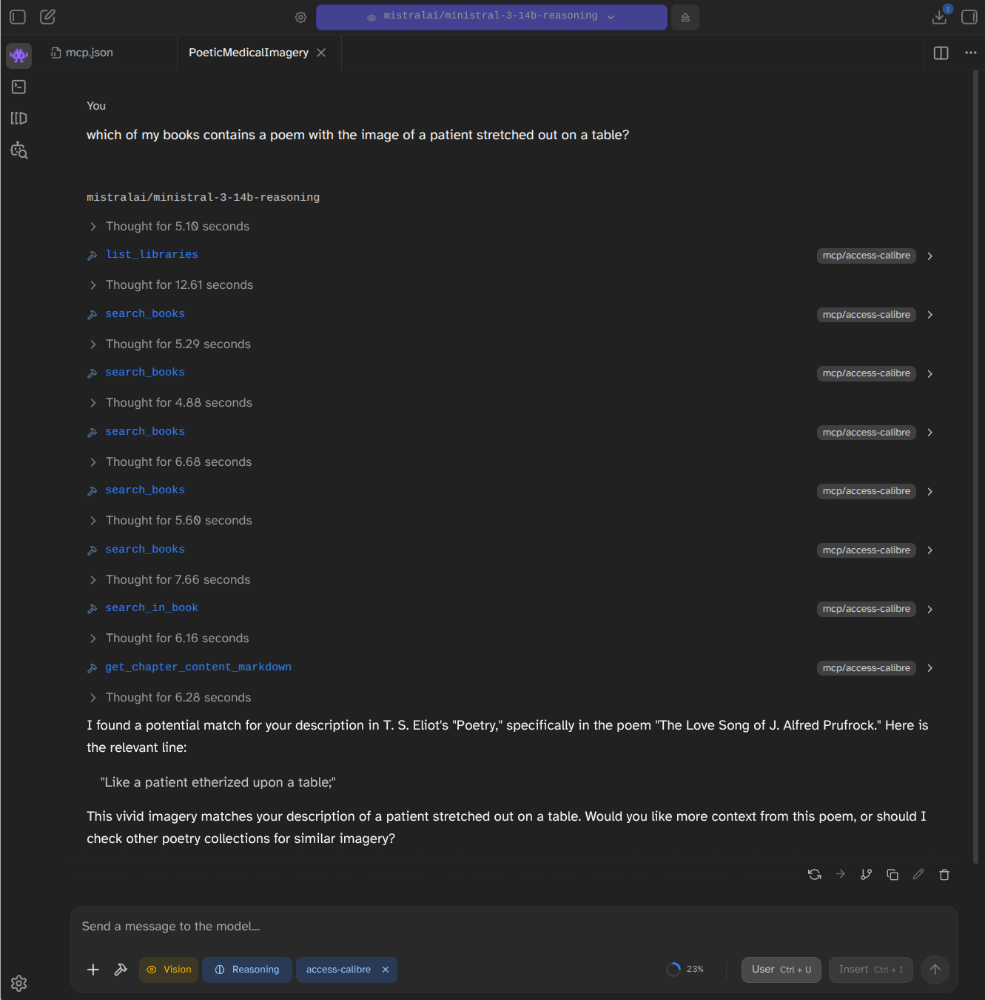
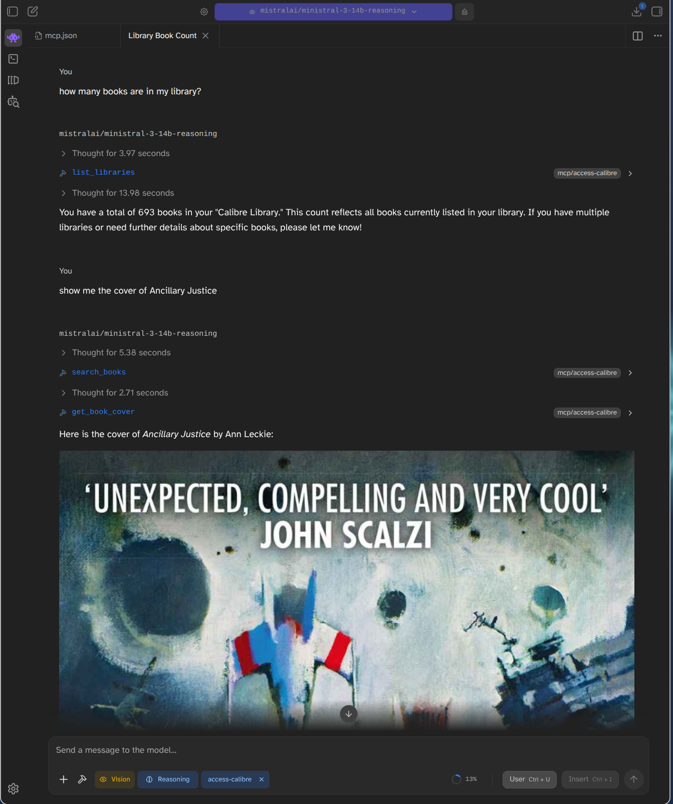

# access-calibre

> [!NOTE]
> This package has been entirely vibe-coded by Junie in JetBrains IntelliJ and not human checked.

A JavaScript library to connect to a local Calibre Content Server and grab portions of ebooks.



You will need to have a Calibre Content Server running locally.  Start one by running calibre and choosing the "Connect/share" option.

## MCP Server

This library includes an MCP (Model Context Protocol) server that allows LLMs to interact with your Calibre library.

### Tools Provided:
- `list_libraries`: List available libraries.
- `search_books`: Search for books using Calibre's search syntax (e.g. by title, author: "author:Asimov").
- `list_books`: List all books in a library.
- `list_chapters`: List the chapters of a book in reading order.
- `get_chapter_content`: Retrieve the HTML content of a specific chapter.
- `get_chapter_content_markdown`: Retrieve the content of a specific chapter converted to Markdown (generally better for LLMs).
- `render_chapter_page`: Render a specific page of a chapter as a PNG image (useful for LLMs with vision capabilities). It also returns the total number of pages in the chapter.
- `get_book_cover`: Retrieve the cover image of a book as a PNG image.
- `search_in_book`: Search for specific literal text within a book and get snippets of occurrences. **Note: ONLY supports simple literal string matching, NO boolean operators (AND/OR) or quotes.**
- `get_epub_file`: Retrieve any file from the EPUB (e.g. CSS, images).





### Configuration
The MCP server can be configured via environment variables:
- `CALIBRE_URL`: The URL of your Calibre Content Server (default: `http://[::1]:8080/`).
- `CALIBRE_USERNAME`: Optional username for authentication.
- `CALIBRE_PASSWORD`: Optional password for authentication.

### Running the MCP Server

#### Logging
You can enable detailed logging of all requests and responses by providing the `--verbose` (or `-v`) argument:

```bash
npx access-calibre --verbose
```

Logs are written to `stderr` so they don't interfere with the MCP protocol.

If you want to direct logs to a file, you can use the `--log-file` argument:

```bash
npx access-calibre --log-file=server.log
```

You can combine both to see logs in `stderr` and save them to a file:

```bash
npx access-calibre --verbose --log-file=server.log
```

#### Claude Desktop

You can run the MCP server directly using `npx` (useful for Claude Desktop or other MCP clients):

```bash
npx access-calibre
```

#### LM Studio

To use this MCP server in LM Studio:

1. Open **LM Studio**.
2. Click on the **Tools** icon (puzzle piece) in the left sidebar.
3. Click **+ Add Tool**.
4. Choose **MCP Server**.
5. Give it a name (e.g., `access-calibre`).
6. For **Command**, enter `npx`.
7. For **Arguments**, enter `access-calibre`.
8. Add any required environment variables (like `CALIBRE_URL`) in the **Environment Variables** section.
9. Click **Add Tool**.

Alternatively, you can add it to your `mcp-config.json` (usually found in `~/.lmstudio/mcp-config.json`):

```json
{
  "mcpServers": {
    "access-calibre": {
      "command": "npx",
      "args": ["access-calibre"],
      "env": {
        "CALIBRE_URL": "http://localhost:8080/"
      }
    }
  }
}
```

#### Local Installation

```bash
npm run start:mcp
```

Or directly via Node:
```bash
CALIBRE_URL=http://localhost:8080 node mcp-server.js
```

## Library Installation

To use it as a library in your project:

```bash
npm install access-calibre
```

## Usage

You can use it as a library in your project:

```javascript
const CalibreClient = require('access-calibre');

const client = new CalibreClient('http://localhost:8080', 'username', 'password');

async function example() {
    // List libraries
    const libraries = await client.getLibraries();
    const libraryId = Object.keys(libraries)[0];

    // List books
    const books = await client.getBooks(libraryId);
    
    // Get EPUB contents
    const bookId = books.book_ids[0];
    const files = await client.getEpubContents(libraryId, bookId);
    console.log('Files in EPUB:', files);

    // Get a specific file (e.g., a chapter) from the EPUB
    const html = await client.getEpubFile(libraryId, bookId, 'index_split_001.html');
    console.log(html);
}
```

## API

### `new CalibreClient(baseUrl, username, password)`
Initialize the client.

### `client.getLibraries()`
Returns an object containing information about available libraries, including book counts.

### `client.getBooks(libraryId, limit, offset, search)`
Returns a list of book IDs and their metadata for the specified library. `search` is an optional search query string in Calibre's search syntax.

### `client.getBookMetadata(libraryId, bookId)`
Returns detailed metadata for a specific book.

### `client.downloadBook(libraryId, bookId, format)`
Downloads the book in the specified format (e.g., 'EPUB', 'PDF') and returns a Buffer.

### `client.getEpubContents(libraryId, bookId)`
Returns a list of file paths inside the EPUB file.

### `client.getTOC(libraryId, bookId)`
Returns an array of `{ title, path }` objects representing the book's Table of Contents.

### `client.getChapters(libraryId, bookId)`
Returns an array of `{ title, path, size }` objects representing the book's chapters in their linear reading order (as defined in the EPUB spine). `size` is the uncompressed size of the chapter file in bytes.

### `client.getChapterContentMarkdown(libraryId, bookId, chapterPath)`
Returns the content of a specific chapter converted to Markdown.

### `client.searchText(libraryId, bookId, query, snippetWindow)`
Searches for `query` text within the book. Returns an array of `{ chapterTitle, chapterPath, offset, snippet, markdownOffset, markdownSnippet }` objects. `snippetWindow` (default 100) is the number of characters to include before and after the match in the snippet. `markdownOffset` and `markdownSnippet` are provided for use with Markdown-based tools.

### `client.getEpubFile(libraryId, bookId, filePath, responseType)`
Extracts a specific file from the EPUB and returns its content as a string (default) or Buffer (if `responseType` is `'buffer'`).

## Scripts

### `get-chapter.js`
Extracts the XML/HTML content of a chapter to the console.
```bash
node get-chapter.js <book_id_or_title> <chapter_index_or_title>
```

### `render-chapter.js`
Renders a specific page from a chapter to a PNG image using Playwright.
```bash
node render-chapter.js <book_id_or_title> <chapter_index_or_title> [output.png] [--page <number>]
```
- `--page <number>`: Optional. Specifies which page of the chapter to render (default is 1).
- If no output filename is provided, it defaults to `chapter_render.png`.

Note: You may need to run `npx playwright install chromium` before using this script.

## Running Tests

```bash
npm test
```
